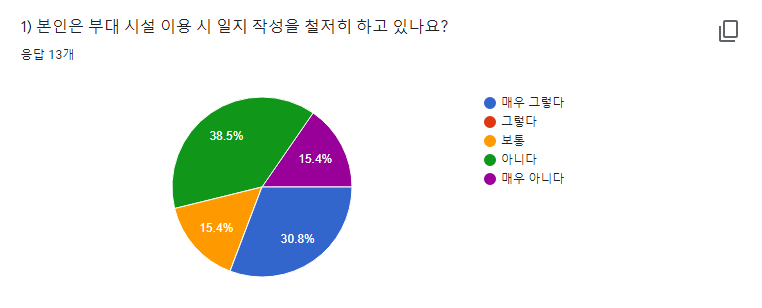
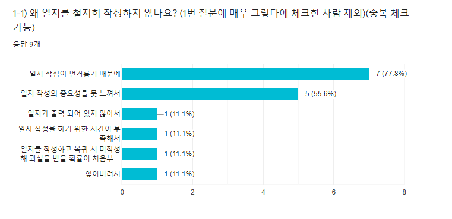
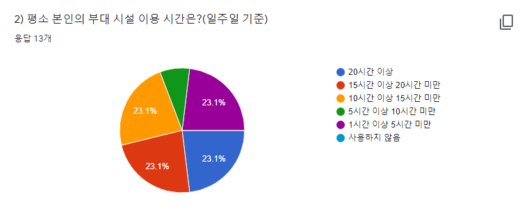
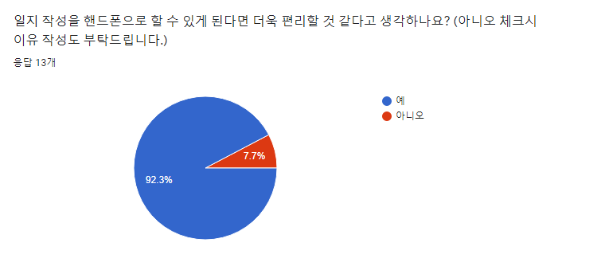
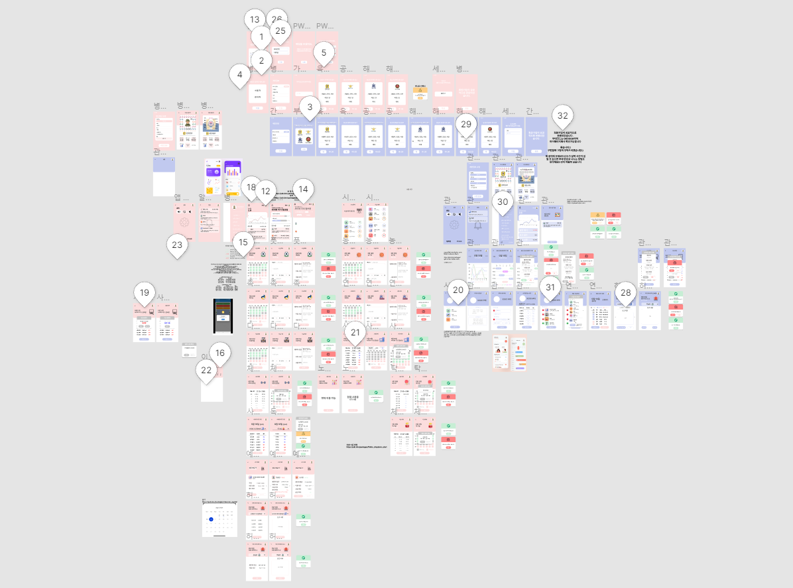
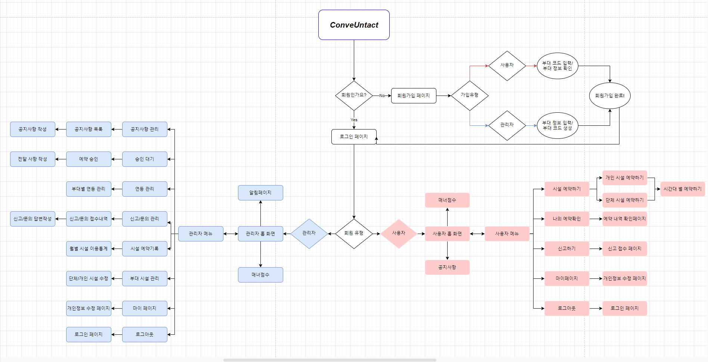

# APP_ConveUntact_Yookhaehan 
컨비언택트_육해한녀석들 ♬

  
<div align='center'>

---  
  
  
<a href=''>

</a>
  
<a href=''>

</a>

<a href=''>

</a>

<a href=''>

</a>

<a href=''>

</a>

</div>


<details open="open">
  <ol>
    <li><a href="#Introduce"><span style="color:grey"> 프로젝트 소개 </span></a></li>
    <li><a href="#Function"><span style="color:grey">기능 설명</a></li>
      <ul>
        <li><a href="#"></a></li>
      </ul>
    <!-- <li><a href="#Prerequisites"><span style="color:grey">컴퓨터 구성 / 필수 조건 안내 (Prequisites)</a></li> -->
    <li><a href="#Stack"><span style="color:grey"> 기술 스택 (Techniques Used)</a></li>
    <li><a href="#Install"><span style="color:grey">설치 안내 (Installation Process)</a></li>
    <!-- <li><a href="#Usage"><span style="color:grey">프로젝트 사용법 (Getting Started)</a></li> -->
    <li><a href="#Team"><span style="color:grey">팀 정보 (Team Information)</a></li>
    <li><a href="#License"><span style="color:grey">저작권 및 사용권 정보 (Copyleft / End User License)</a></li>
  </ol>
</details>

--- 
<h2 id="Introduce", align='center'>프로젝트 소개</h2>

<p></p>

##  왜 이 앱을 만들게 되었나요 ❓ 
✔️ 現 군대에는 장병들을 위한 많은 시설들이 존재합니다. 운동을 할 수 있는 헬스장, 컴퓨터를 할 수 있는 사이버지식정보방, 노래를 부르며 신나게 놀 수 있는 노래방이 있습니다. 현재 장병들은 시설물을 사용하기 위해 일지를 수기로 작성하고 있습니다. 일지 작성을 통해 각 시설마다 사용률을 파악할 수 있으며 장병들이 어떤 시설을 많이 사용하는지 확인이 가능합니다. 하지만 모두가 일지작성을 제대로 하고 있지 않다면 어떨까요? 문제는 여기서 발생하게 됩니다. 저를 비롯한 주위 병사들 대부분은 직접 수기로 작성하는것을 번거롭다는 이유 등으로 제대로 작성하지 않고 있습니다.
<table>
    <tr>
        <td width="50%">
            
        </td>
    </tr>
    <tr>
        <td align="center">
            <a href="/workspaces/APP_ConveUntact_Yookhaehan/Images/yesorno.PNG">일지 작성 현황</a>
        </td>
    </tr>
</table>

###### 설문조사 대상 (해군직할부대/사이버작전센터/병사13명)

✔️ 위 설문조사 자료에 따르면 일지 작성을 철저히 하고있는 병사는 30.8%이며 나머지 69.2% 병사들은 일지 작성을 철저히 하고 있지 않다는 사실을 확인할 수 있습니다.

<table>
    <tr>
        <td width="50%">
            
        </td>
    </tr>
    <tr>
        <td align="center">
            <a href="/workspaces/APP_ConveUntact_Yookhaehan/Images/reason.PNG">일지 미작성 이유</a>
        </td>
    </tr>
</table>

###### 설문조사 대상 (해군직할부대/사이버작전센터/병사13명)

✔️ 위 설문조사 자료에 따르면 대부분의 병사들은 일지 작성이 번거롭거나 일지 작성의 중요성을 느끼지 못하였기 때문에 작성하고 있지 않았습니다.

<table>
    <tr>
        <td width="50%">
            
        </td>
    </tr>
    <tr>
        <td align="center">
            <a href="/workspaces/APP_ConveUntact_Yookhaehan/Images/time.PNG">개인별 부대 시설 이용 시간</a>
        </td>
    </tr>
</table>

###### 설문조사 대상 (해군직할부대/사이버작전센터/병사13명)
✔️ 또한 대부분의 병사들은 1주에 10시간 이상 시설을 사용하고 있었습니다. 이는 현재 부대 시설별 정확한 사용률 파악을 하고 있지 못하다는 의미이며 제대로 된 시설 관리가 힘들 수 있다는 것을 나타냅니다.

<table>
    <tr>
        <td width="50%">
            
        </td>
    </tr>
    <tr>
        <td align="center">
            <a href="Images/conve.PNG">긍정적 반응</a>
        </td>
    </tr>
</table>

###### 설문조사 대상 (해군직할부대/사이버작전센터/병사13명)
✔️ 대부분의 병사들은 시설물을 이용하기 위해 현 방식인 수기로 일지를 작성하는 것 보다 휴대폰을 이용하여 작성하는 것에 대해 긍정적인 반응을 보였습니다. 설문조사는 병사들을 대상으로 밖에 하지 못했지만 관리자 입장 즉 간부님들의 입장에서도 일지 관리가 더욱 편리해질것으로 기대되며, 각 시설물마다 사용률 파악을 통해 시설물 관리에 도움이 될 것입니다.

<p></p>

## 이 앱은 무엇인가요❓
✔️ 現 군에서는 시설예약 및 방문 내역을 수기로 작성하여 관리하고 있습니다.(ex. 종교시설, 헬스장, 노래방, 사이버지식정보방 등) 이는 수기로 작성하고, 수기로 작성한 내용을 컴퓨터로 옮기는 작업같은 불편함이 발생합니다. 해당 프로젝트는 수기 예약 및 관리에 대한 효율성과 편의성을 높이기 위한 비대면 시설 예약 앱입니다.

## 이 앱을 통해 무엇을 얻을 수 있을까요❓
✔️ 기존 방식의 시설예약 및 일지 작성 문제 등을 해결할 수 있습니다. 해당 앱이 활성화 될 경우 장병들의 시설 이용 현황 파악에 용이하여 부대 시설 운용에도 도움이 될 것으로 기대됩니다. 또한 Covid-19로 인해 비대면 서비스가 활성화되는 가운데 감염에 대한 위험부담도 낮출 수 있으며,  부대 내 병들의 휴대폰 사용이 활성화됨에 따라 시설들을 앱의 예약기능을 이용해 편의성을 높일 수 있습니다.

---
<p></p>

## 🖌️ UI/UX Design 

✔️ 저희 팀은 앱 UI, UX 디자인을 위해 Figma를 사용했으며 App flow 구상은 app.diagrams을 이용하였습니다.

<table>
    <tr>
        <td width="50%">
            
        </td>
        <td width="50%">
            
        </td>
    </tr>
    <tr>
        <td align="center">
            <a href="/workspaces/APP_ConveUntact_Yookhaehan/Images/figma11.PNG">UI Prototyping</a>
        </td>
        <td align="center">
            <a href="/workspaces/APP_ConveUntact_Yookhaehan/Images/figma22.PNG">UX Prototyping (Add Comment)</a>
        </td>
    </tr>
</table>

<table>
    <tr>
        <td width="50%">
            
        </td>
    </tr>
    <tr>
        <td align="center">
            <a href="/workspaces/APP_ConveUntact_Yookhaehan/Images/app_flow.PNG">App flow</a>
        </td>
    </tr>
</table>

---

<h2 id="Function"align='center'>기능 설명</h2>
###

--- 
<!-- <h2 id="Prerequisites">컴퓨터 구성 / 필수 조건 안내 (Prerequisites)</h2>

* ECMAScript 6 지원 브라우저 사용
* 권장: Google Chrome 버젼 77 이상 -->


<h2 id="Stack"align='center'>기술 스택 (Technique Used)</h2>


### Infra
<table><tbody>
 <tr>
  <td>
   <div align="center"><a href="https://git-scm.com/" target="_blank">  </a><br>Git</div>
  </td>
  <td>
   <div align="center"><a href="https://www.docker.com/" target="_blank">  </a><br>docker</div>
  </td>
 </tr>
 </tbody></table>
 
### Front-end
<table><tbody>
 <tr>
  <td>
   <div align="center"><a href="https://babeljs.io/" target="_blank">  </a><br>Dart</div>
  </td>
  <td>
   <div align="center"><a href="https://webpack.js.org" target="_blank">  </a><br>Flutter</div>
  </td>
 </tr>
 </tbody></table>

 ### Back-end
<table><tbody>
 <tr>
  <td width="80">
   <div align="center"><a href="https://jwt.io" target="_blank">  </a><br>firebase</div>
  </td>
  </td>
 </tr>
 </tbody></table>

---

## Flutter / Dart Packages

- flutter_svg: ^0.22.0
- syncfusion_flutter_charts: ^19.3.45+1  
- cupertino_icons: ^1.0.2
- flutter_animated_button: ^2.0.0
- firebase_core: ^1.6.0
- firebase_auth: ^3.1.1
- cloud_firestore: ^2.5.3
- awesome_dropdown: ^0.0.4
- multi_select_flutter: ^4.0.0
- google_fonts: ^2.1.0
- draggable_home: ^1.0.2
- menu_button: ^1.4.2+1
- fluent_ui: ^3.2.0
- flutter_combo_box: ^0.0.2+5
- card_swiper: ^1.0.4
- flutter_swiper: ^1.1.6
- smooth_page_indicator: ^1.0.0+2
- flutter_lints: ^1.0.0
- get: ^4.3.8
- fl_chart: ^0.40.0
- cool_alert: ^1.1.0
- flutter_slider_drawer: ^2.0.0
- flutter_login: ^2.2.1
- validators: ^3.0.0
- uuid: ^3.0.5
---

 
<h2 id="Install"align='center'> 설치 안내 (Installation Process)</h2>

```bash
$ gh repo clone osamhack2021/APP_ConveUntact_Yookhaehan
$ flutter pub get
$ cd myapp
$ flutter run -d web-server --web-hostname=0.0.0.0
```
---

<!-- <h2 id="Usage"> align='center'프로젝트 사용법 (Getting Started)</h2>
 ### -->


<h2 id="Team"align='center'> 팀 정보 (Team Information)</h2>

<table width="900">
<thead>
<tr>
<th width="100" align="center">Profile</th>
<th width="100" align="center">Name</th>
<th width="250" align="center">Role</th>
<th width="200" align="center">Github</th>
<th width="300" align="center">E-mail</th>
</tr> 
</thead>
<tbody>
	
<tr>
<td width="120" align="center"></td>
<td width="100" align="center">고승현</td>
<td width="250">Front Developer<br>Fimga Designer</td>
<td width="150" align="legt">	
	<a href="https://github.com/chris0825">
	
	</a>
</td>
<td width="300" align="">
<a href="mailto:chris00825@naver.com"></a>
</tr>
	
<tr>
<td width="120" align="center"></td>
<td width="100" align="center">최은총</td>
<td width="250">Back Developer<br></td>
<td width="150" align="">	
	<a href="https://github.com/dmsvk01">
	
	</a>
</td>
<td width="300" align="">
<a href="mailto:21900757@handong.edu"></a>
</tr>
	
<tr>
<td width="120" align="center"></td>
<td width="100" align="center">최지호</td>
<td width="250">Product Manager<br></td>
<td width="150" align="">	
	<a href="https://github.com/zhoho">
	
	</a>
</td>
<td width="300" align="">
<a href="mailto:chlwlgh1011@naver.com"></a>
</tr>

	
	
	
</tr>
</tbody>
</table>

---

<h2 id="License"align='center'> 저작권 및 사용권 정보 (Copyleft / End User License)</h2>

 * [Apache License Version 2.0](https://github.com/osamhack2021/APP_ConveUntact_Yookhaehan/blob/087779542519392c87bed3a020da7c4289ca3104/LICENSE)


